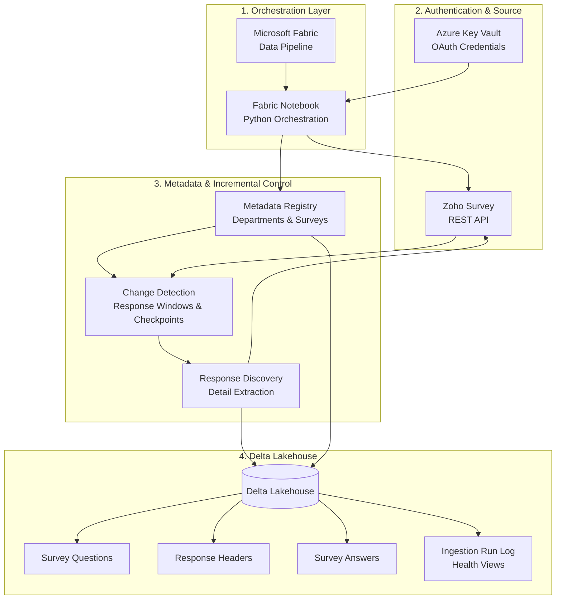

\# Architecture Diagram

The following diagram represents the sanitized production architecture of the

metadata-driven survey ingestion framework.

\## Processing flow

The Fabric pipeline triggers the ingestion notebook. Authentication credentials

are retrieved securely from Azure Key Vault and used to obtain access to the

Zoho Survey REST API.

The framework uses metadata registries to identify active surveys and detect

source activity. Incremental response windows are calculated from ingestion

checkpoints, after which new response identifiers are discovered and response

details are extracted.

The resulting data is persisted into normalized Delta Lakehouse structures for

survey metadata, questions, response headers, answers, and operational

monitoring.

Production identifiers, credentials, organizational names, survey responses,

and other sensitive information are intentionally excluded from this public

architecture.

